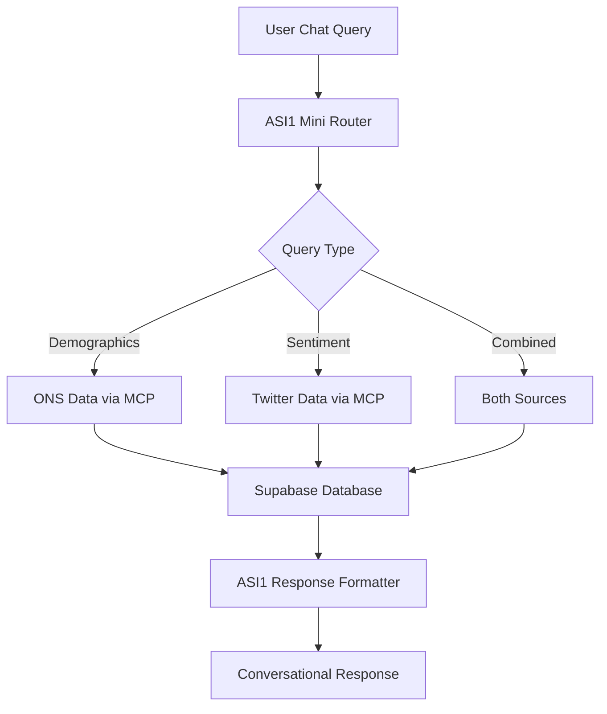

# Vaccine Hesitancy Insights Agent


## Overview

The **Vaccine Hesitancy Insights Agent** is an advanced AI-powered analytics platform that provides comprehensive insights into vaccine hesitancy patterns across the UK through conversational AI. This enhanced version combines official ONS (Office for National Statistics) demographic data with real-time Twitter sentiment analysis to deliver multi-dimensional insights for public health professionals, policymakers, and researchers.

### Key Capabilities

- **🎯 Intelligent Query Routing**: Automatically determines whether to query demographic data, social media sentiment, or both based on natural language input
- **📊 Comprehensive Demographics**: Analysis across 19 demographic dimensions including age, sex, ethnicity, religion, disability status, employment, and more
- **🐦 Social Media Intelligence**: Real-time Twitter sentiment analysis, engagement metrics, and viral content tracking
- **🤖 AI-Powered Insights**: Uses ASI1 Mini for natural language query understanding and intelligent response generation
- **🔗 Advanced Connectivity**: Model Context Protocol (MCP) integration for robust database connections
- **💬 Conversational Interface**: Natural language chat protocol for interactive analysis

## Architecture



### Technical Stack

- **Framework**: Fetch.ai uAgents with Chat Protocols
- **AI Model**: ASI1 Mini for query understanding and response generation
- **Database**: Supabase (PostgreSQL) with ONS and Twitter datasets
- **Connectivity**: Model Context Protocol (MCP) via Smithery.ai
- **Interface**: Chat Protocol for agent-to-agent and human-agent communication

## Agent Features

### Chat Protocol Agent (`vh_agent.py`)
- **Purpose**: Conversational AI interface and agent-to-agent communication
- **Features**: Natural language queries, intelligent routing, contextual responses
- **Use Case**: Interactive analysis, research assistance, agent orchestration
- **Port**: 8001 (configurable)
- **Mailbox**: Enabled for Agentverse integration

## Data Sources

### ONS Vaccine Hesitancy Data
Comprehensive demographic analysis across 19 data tables:

#### Core Demographic Tables
- **vaccine_hesitancy_region**: Regional breakdown with measures and percentages
- **vaccine_hesitancy_age**: Age band analysis with confidence intervals
- **vaccine_hesitancy_age_group**: Broader age group categorization
- **vaccine_hesitancy_sex**: Gender-based vaccination patterns
- **vaccine_hesitancy_ethnicity**: Ethnic group vaccination analysis
- **vaccine_hesitancy_religion**: Religious affiliation impact on vaccination

#### Health & Medical Status Tables  
- **vaccine_hesitancy_disability**: Disability status vaccination patterns
- **vaccine_hesitancy_cev**: Clinically Extremely Vulnerable analysis
- **vaccine_hesitancy_health_condition**: Underlying health condition impact
- **vaccine_hesitancy_health_general_condition**: General health status analysis

#### Socioeconomic Tables
- **vaccine_hesitancy_employment**: Employment status vaccination patterns
- **vaccine_hesitancy_imd_quintile**: Deprivation index analysis
- **vaccine_hesitancy_expense_affordability**: Financial barrier analysis
- **vaccine_hesitancy_household_type**: Household composition impact
- **vaccine_hesitancy_caregiver_status**: Caregiver role vaccination patterns

#### Advanced Analytical Tables
- **vaccine_hesitancy_age_sex**: Cross-demographic age-gender analysis
- **vaccine_hesitancy_trends**: Temporal vaccination trend analysis
- **vaccine_hesitancy_barriers**: Systematic barrier identification
- **vaccine_hesitancy_reasons**: Detailed hesitancy reason categorization

**Data Fields**: Each table includes measures, percentages, confidence intervals (LCL/UCL), weighted counts, sample sizes, and temporal wave data where applicable.

### Twitter Sentiment Data
Real-time social media intelligence including:
- **Sentiment Analysis**: Positive, negative, neutral classification
- **Engagement Metrics**: Likes, retweets, replies, reach
- **Temporal Trends**: Sentiment evolution over time
- **Influencer Analysis**: Top users, viral content
- **Content Analysis**: Hashtags, mentions, topics

## Chat Protocol Usage

### Natural Language Queries

The chat agent supports conversational queries like:

#### Demographic Analysis
- "Show me vaccine hesitancy by gender"
- "What's the uptake rate in London?"
- "Compare hesitancy across ethnic groups"
- "How does age affect vaccine acceptance?"
- "Show me employment-based vaccination patterns"
- "What's the vaccination rate among disabled people?"
- "Compare hesitancy between different religions"
- "How does household type affect vaccine decisions?"
- "Show me vaccination patterns by deprivation quintile"
- "What's the uptake among clinically extremely vulnerable people?"
- "Compare caregiver vs non-caregiver vaccination rates"
- "How does expense affordability impact vaccination?"

#### Social Media Analysis
- "What's the current vaccine sentiment on Twitter?"
- "Show me trending vaccine discussions"
- "Who are the top vaccine influencers?"
- "How has vaccine sentiment changed over time?"
- "What are people saying about vaccine side effects?"

#### Combined Analysis
- "Compare demographic data with social media sentiment"
- "How does online sentiment relate to actual uptake rates?"
- "Which regions have negative social media sentiment?"
- "Do Twitter trends match demographic hesitancy patterns?"

#### Barriers and Reasons Analysis
- "What are the main barriers to vaccination among young adults?"
- "Why do people in certain regions avoid vaccines?"
- "What health concerns are driving hesitancy?"
- "How do religious beliefs affect vaccination decisions?"

### Chat Integration Example

```python
from uagents_core.contrib.protocols.chat import ChatMessage, TextContent
from datetime import datetime
from uuid import uuid4

# Send message to agent
message = ChatMessage(
    timestamp=datetime.utcnow(),
    msg_id=uuid4(),
    content=[TextContent(
        type="text", 
        text="What are the main reasons for vaccine hesitancy among young adults?"
    )]
)
```

### Agent-to-Agent Communication

```python
from uagents import Agent, Context, Protocol
from datetime import datetime

# Example client agent communicating with VH agent
client_agent = Agent(name="vh_client", port=8002)

VH_AGENT_ADDRESS = "agent1qwx5r73e4c..."  # VH agent address

@client_agent.on_event("startup")
async def send_query(ctx: Context):
    query = ChatMessage(
        timestamp=datetime.utcnow(),
        msg_id=uuid4(),
        content=[TextContent(
            type="text",
            text="Compare vaccine hesitancy between London and Manchester"
        )]
    )
    await ctx.send(VH_AGENT_ADDRESS, query)
```

## Environment Setup

### Required Environment Variables

Create a `.env` file with the following variables:

```bash
# Supabase Configuration
SUPABASE_ACCESS_TOKEN=your_supabase_access_token
SUPABASE_PROJECT_ID=your_project_id

# Smithery.ai MCP Integration
SMITHERY_API_KEY=your_smithery_api_key

# ASI1 Mini API
ASI1_API_KEY=your_asi1_api_key
```

### Dependencies

```bash
# Core uAgents framework
pip install uagents==0.22.5

# MCP integration
pip install mcp

# Additional dependencies
pip install python-dotenv requests asyncio
```

### Installation

1. **Clone and Navigate**:
   ```bash
   cd agents/Vaccine_Hesitancy_Insights_Agent
   ```

2. **Install Dependencies**:
   ```bash
   pip install -r requirements.txt
   ```

3. **Configure Environment**:
   ```bash
   cp .env.example .env
   # Edit .env with your API keys
   ```

4. **Run Chat Agent**:
   ```bash
   python vh_agent.py
   ```

## Usage Examples

### Example 1: Demographic Analysis Query

```python
# Natural language query about regional differences
query = "Compare vaccine hesitancy between different age groups in Scotland"
# Agent automatically routes to appropriate ONS data tables and provides insights
```

### Example 2: Social Media Sentiment Analysis

```python
# Query about current online sentiment
query = "What's the current sentiment about vaccines on social media?"
# Agent routes to Twitter sentiment data and provides trend analysis
```

### Example 3: Combined Data Analysis

```python
# Complex query requiring both data sources
query = "How does vaccine sentiment on Twitter compare to actual vaccination rates by region?"
# Agent intelligently combines ONS demographic data with Twitter sentiment
```

### Example 4: Specific Demographic Focus

```python
# Targeted demographic analysis
query = "What are the vaccination barriers for disabled people in employment?"
# Agent queries specific demographic intersections
```

## Intelligent Query Routing

The agent uses ASI1 Mini to automatically determine the best data source(s) for each query:

### ONS Data Routing
Queries containing demographic terms like:
- Age, gender, ethnicity, religion
- Employment, disability, health conditions
- Regional analysis, barriers, reasons
- Trends over time

### Twitter Data Routing
Queries about social media aspects like:
- Sentiment, engagement, viral content
- Influencers, trending topics
- Online discussions, timeline analysis
- Social media trends

### Combined Routing
Complex analytical queries requiring both sources:
- Comparative analysis between online sentiment and demographics
- Regional sentiment vs vaccination rates
- Influence of social media on demographic patterns

## Response Formatting

The agent provides intelligent, context-aware responses:

### Structured Data Presentation
- Clear categorization of findings
- Statistical summaries with key insights
- Trend analysis with temporal context
- Comparative analysis across demographics

### Conversational Style
- Human-readable explanations
- Key takeaways highlighted
- Actionable insights provided
- Follow-up suggestions offered

## Data Models

### Complete ONS Demographic Dimensions (19 Categories)

#### Geographic & Regional
- **Regions**: "South East", "Scotland", "Wales", "East of England", "North West", "North East", "England", "South West", "London"

#### Age & Gender Demographics  
- **Age Bands**: Specific age ranges (e.g., "30-49")
- **Age Groups**: "16 to 29", "30 to 49", "Aged 50 and over", "All adults"
- **Sex**: "Male", "Female"
- **Age-Sex Cross Analysis**: Combined age and gender breakdowns

#### Ethnicity & Religion
- **Ethnicity**: "White British", "Asian", "Black", "Mixed", "Other ethnic groups"
- **Religion**: "Christian", "Muslim", "Hindu", "Jewish", "Sikh", "Buddhist", "No religion", "Other religion"

#### Health & Medical Status
- **Disability Status**: "Disabled", "Non-disabled"
- **CEV Status**: "Clinically Extremely Vulnerable", "Non-CEV"
- **Health Conditions**: "Has underlying condition", "No underlying condition"
- **General Health Condition**: Various health status categories

#### Socioeconomic Factors
- **Employment Status**: "Employed", "Unemployed", "Retired", "Other"
- **IMD Quintile**: "1-most deprived", "2", "3", "4", "5-least deprived"
- **Expense Affordability**: "Can afford", "Cannot afford", "Other"
- **Household Type**: "Single", "Couple", "Family", "Other"
- **Caregiver Status**: "Caregiver", "Non-caregiver"

#### Analytical Dimensions
- **Trends Analysis**: Temporal patterns across time periods
- **Barriers Analysis**: Obstacles to vaccination by demographic group
- **Reasons Analysis**: Specific reasons for vaccine hesitancy by category

### Query Response Model
```python
class VHAgentResponse(Model):
    response: str  # Formatted insights and analysis
    status: str    # 'success', 'error', or 'unavailable'
```

## Performance and Reliability

### Features
- **Automatic Reconnection**: MCP client handles connection failures gracefully
- **Retry Logic**: Failed queries are automatically retried up to 3 times
- **Error Handling**: Comprehensive error handling with informative messages
- **Intelligent Fallbacks**: Multiple routing strategies for query understanding

### Monitoring
- Structured logging for all operations
- Query execution time tracking
- Connection status monitoring
- Conversation context tracking

## Advanced Features

### Intelligent Query Understanding
- Natural language to SQL conversion using ASI1 Mini
- Context-aware query refinement
- Multi-source data correlation
- Fallback routing for ambiguous queries

### Conversational Memory
- Session-based context tracking
- Follow-up query understanding
- Conversation flow management
- Agent acknowledgment handling

### Extensible Architecture
- Modular design for easy addition of new data sources
- Protocol-based communication for agent orchestration
- Scalable chat protocol implementation

## Troubleshooting

### Common Issues

1. **Connection Errors**: Check environment variables and network connectivity
2. **Authentication Failures**: Verify API keys are correctly configured
3. **Query Understanding Issues**: Rephrase queries with more specific terms
4. **Timeout Issues**: Check MCP server availability and retry logic

### Debug Mode

Enable debug logging by setting:
```bash
export LOG_LEVEL=DEBUG
```

### Chat Protocol Debugging

Monitor chat message flow:
```python
# Enable chat protocol logging
ctx.logger.info(f"Received chat message: {msg.content}")
ctx.logger.info(f"Sending response to: {sender}")
```

## Agent Communication

### Chat Protocol Specification
The agent implements the standard uAgents chat protocol:
- Message acknowledgment system
- Session management
- Content type handling (text, end-session)
- Timestamp and message ID tracking

### Integration with Other Agents
- Can be integrated into multi-agent systems
- Supports agent-to-agent queries
- Provides structured responses for downstream processing
- Compatible with agent orchestration frameworks

## Contributing

This agent is part of the Vaccine Hesitancy Analysis Platform. For contributions:

1. Follow Fetch.ai uAgents development guidelines
2. Ensure new features maintain chat protocol compatibility
3. Add appropriate error handling for new query types
4. Update documentation for any capability changes

## License

This project is part of the Fetch.ai Innovation Lab ecosystem.

---

**Agent Address**: Generated deterministically from seed configuration
**Default Port**: 8001 (configurable)
**Mailbox**: Enabled for Agentverse integration
**Chat Protocol**: Fully compatible with uAgents chat specification 